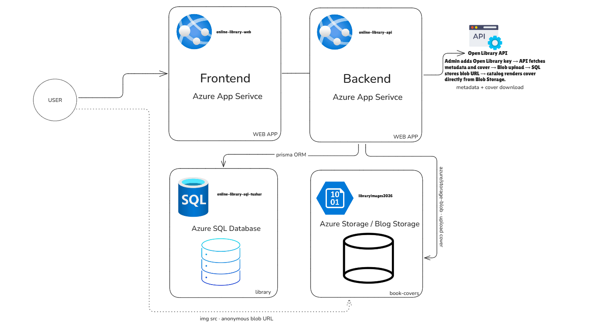

# Online Library Management System

A full-stack online library, built as a capstone project demonstrating Azure Compute, Database, and Storage services.

## Docs

- CLICK - [Project Report](https://app.notion.com/p/Project-Report-Azure-Project-3d794c0ae3cc80479c8be880dac06090?source=copy_link)
- CLICK - [Azure Price Calculator Report](https://docs.google.com/spreadsheets/d/1ahLcnzXFNaHuTz602MTDs_Tvubsepl5y/edit?usp=sharing&ouid=104002214421850971249&rtpof=true&sd=true)

## Stack

- **Client:** Next.js 16, React 19, Tailwind CSS v4
- **Server:** Node.js 20+, Express 5, Prisma 6
- **Data:** Azure SQL Database and Azure Blob Storage
- **Auth:** JWT and bcrypt with MEMBER / ADMIN roles

## Azure Services Used

| Azure Service | Used For |
| --- | --- |
| Azure App Service | Hosting the Next.js client and Express API |
| Azure SQL Database | Storing users, books, and borrowing records |
| Azure Blob Storage | Storing book cover images |

## Architecture



## Run Locally

Requirements: SQL Server and Azure Blob Storage, or [Azurite](https://github.com/Azure/Azurite) for local storage.
### Server

```bash
cd server
npm install
cp .env.example .env
npm run db:push
npm run dev
```
Set these values in `server/.env`:

```
PORT=4000
JWT_SECRET=<long random string>
CLIENT_ORIGIN=http://localhost:3000
DATABASE_URL="sqlserver://localhost:1433;database=library;user=sa;password=Your_password123;encrypt=true;trustServerCertificate=true"
AZURE_STORAGE_CONNECTION_STRING="UseDevelopmentStorage=true"
AZURE_STORAGE_CONTAINER=book-covers
```

### Client

```bash
cd client
npm install
cp .env.example .env.local
npm run dev
```

### Create an admin

```bash
cd server
npm run make-admin -- you@example.com
npm run make-admin -- admin@example.com "Admin" "password123"
```

Then sign in, open **Manage Catalog**, and add books.

---

## API

| Method | Route | Auth | Description |
| --- | --- | --- | --- |
| POST | `/api/auth/register` | — | Create account, returns token |
| POST | `/api/auth/login` | — | Log in, returns token |
| GET | `/api/auth/me` | user | Current user |
| GET | `/api/books` | — | Browse catalog (`?q=` `?genre=` `?page=`) |
| GET | `/api/books/:id` | — | One catalog book |
| GET | `/api/books/borrowed` | user | Active loans (`overdue`, `days_remaining`) |
| GET | `/api/books/history` | user | Full borrowing history |
| POST | `/api/books/borrow` | user | Borrow by `{ book_id }` |
| POST | `/api/books/return` | user | Return by `{ book_id }` (kept as history) |
| GET | `/api/books/search` | admin | Search Open Library |
| POST | `/api/books/catalog` | admin | Add a book (metadata + cover pipeline) |
| DELETE | `/api/books/:id` | admin | Remove a book (if never borrowed) |
| GET | `/api/health` | — | Liveness + database ping |
